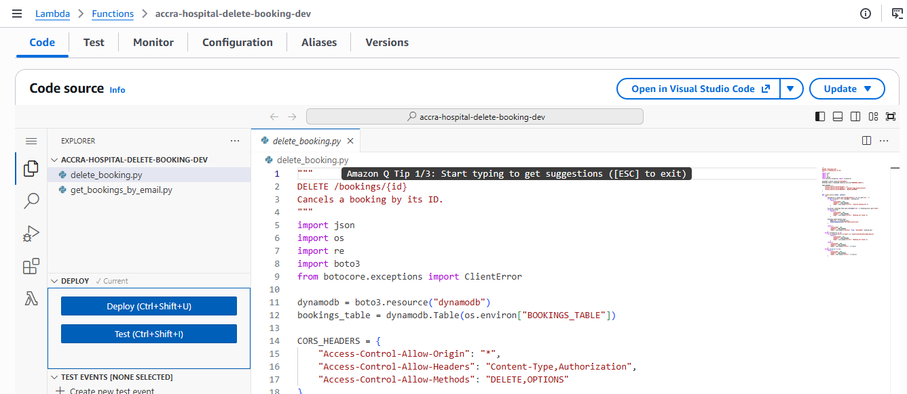

# AccraCare — Serverless Hospital Appointment Booking System

Capstone project for the Generation Ghana / Azubi Africa AWS Cloud Computing Programme.

AccraCare replaces manual appointment booking (paper forms / spreadsheets) with a
scalable serverless REST API backed entirely by AWS managed services, deployed
with AWS SAM (CloudFormation).

**🔗 Live Demo:** https://dvm40sl310hkp.cloudfront.net

---

## Table of Contents

- [AccraCare — Serverless Hospital Appointment Booking System](#accracare--serverless-hospital-appointment-booking-system)
  - [Table of Contents](#table-of-contents)
  - [Tech Stack](#tech-stack)
  - [Quick Start](#quick-start)
  - [Problem Statement](#problem-statement)
  - [Architecture](#architecture)
  - [Screenshots](#screenshots)
    - [Architecture diagram](#architecture-diagram)
    - [Cloudformation stack](#cloudformation-stack)
    - [SNS](#sns)
    - [Homepage or frontend ui](#homepage-or-frontend-ui)
    - [Book Appointment](#book-appointment)
    - [Dynamo db slots](#dynamo-db-slots)
    - [Lambda delete booking](#lambda-delete-booking)
    - [Cloudwatch lambda logs](#cloudwatch-lambda-logs)
  - [REST API Endpoints](#rest-api-endpoints)
  - [Project Layout](#project-layout)
  - [File \& Folder Reference](#file--folder-reference)
  - [Phase Deliverables Checklist](#phase-deliverables-checklist)
    - [Phase 1 — Infrastructure Foundation](#phase-1--infrastructure-foundation)
    - [Phase 2 — API Development](#phase-2--api-development)
    - [Phase 3 — Automation \& CI/CD](#phase-3--automation--cicd)
    - [Phase 4 — Monitoring \& Security](#phase-4--monitoring--security)
    - [Phase 5 — Deployment \& Optimisation](#phase-5--deployment--optimisation)
  - [AWS Deployment Guide](#aws-deployment-guide)
  - [Local Development](#local-development)
  - [GitHub Actions Secrets Required](#github-actions-secrets-required)
  - [Security Hardening](#security-hardening)
    - [Authentication \& Authorization](#authentication--authorization)
    - [Data Protection](#data-protection)
    - [CORS Hardening](#cors-hardening)
    - [Input Validation \& Injection Prevention](#input-validation--injection-prevention)
    - [Cryptography](#cryptography)
    - [Rate Limiting \& Throttling](#rate-limiting--throttling)
  - [Known Limitations](#known-limitations)
  - [Roadmap / What's Next](#roadmap--whats-next)
  - [Built With / Acknowledgements](#built-with--acknowledgements)

---

## Tech Stack

- **Node.js 22** — TypeScript Lambda handlers (deployed)
- **Python 3.12** — Python Lambda handlers (deployed)
- **AWS Lambda** — serverless compute
- **API Gateway** — REST API with CORS, throttling, access logging
- **DynamoDB** — NoSQL database with GSIs, TTL, PITR, SSE-KMS
- **S3** — static frontend hosting (SSE-S3 encrypted, versioned)
- **CloudFront** — CDN with HTTPS enforcement
- **SNS** — email confirmations and operational alerts
- **CloudWatch** — logs, alarms, dashboard
- **AWS SAM / CloudFormation** — infrastructure as code
- **GitHub Actions** — CI/CD pipeline

---

## Quick Start

```bash
# 1. Build
sam build

# 2. First deploy (interactive — enter your emails when prompted)
sam deploy --guided

# 3. Every deploy after that
sam deploy

# 4. Seed demo slots
cd backend/seed
python load_seed_data.py <SlotsTableName_from_output>

# 5. Upload frontend
aws s3 sync ../../frontend s3://<FrontendBucketName_from_output> --delete

# 6. Get the live URL
sam list stack-outputs --stack-name accra-hospital-capstone
```

---

## Problem Statement

Outpatient clinics in Accra manage appointment bookings manually — patients queue,
staff use spreadsheets, and there is no real-time seat availability. AccraCare
replaces this with a self-service web portal and a REST API that enforces seat
limits, prevents double-booking via atomic DynamoDB conditional writes, and sends
confirmation emails automatically via SNS.

---

## Architecture


The stack is a mix of **Node.js 22 (TypeScript)** and **Python 3.12** Lambda handlers — one function per endpoint — deployed as a single CloudFormation stack defined in `template.yaml`.

---

## Screenshots

### Architecture diagram

**AccraCare architecture**


### Cloudformation stack

**Cloudformation stack**


### SNS

**SNS**


### Homepage or frontend ui

**Homepage or frontend ui**


### Book Appointment

**Book Appointment**


### Dynamo db slots

**Dynamo db slots**


### Lambda delete booking

**Lambda delete booking**


### Cloudwatch lambda logs

**Cloudwatch lambda logs**


---

## REST API Endpoints

| Method | Path                       | Description                         |
| ------ | -------------------------- | ----------------------------------- |
| GET    | /health                    | Health check                        |
| GET    | /status                    | Service metadata                    |
| POST   | /slots                     | Create an appointment slot (admin)  |
| GET    | /slots                     | List all available slots            |
| POST   | /slots/{slotId}/book       | Book a slot — register for an event |
| PATCH  | /slots/{slotId}/status     | Open / close a slot (admin)         |
| GET    | /bookings                  | List all bookings                   |
| GET    | /bookings/by-email/{email} | View registrations by patient email |
| DELETE | /bookings/{id}             | Cancel a registration               |
| GET    | /doctors                   | List all doctors                    |
| POST   | /doctors                   | Create a doctor record (admin)      |
| GET    | /appointments              | List all appointments               |
| POST   | /appointments              | Create an appointment (admin)       |
| GET    | /appointments/{id}         | Get appointment by ID               |
| DELETE | /appointments/{id}         | Delete an appointment (admin)       |

---

## Project Layout

```
accra-hospital-capstone/
├── template.yaml                        # SAM/CloudFormation — all AWS resources
├── samconfig.toml                       # sam deploy defaults
├── .github/workflows/deploy.yml         # CI/CD: test → build → deploy → seed → sync
├── frontend/                            # Static website (index.html, admin.html)
│   └── scripts/api.js                   # Calls the real API Gateway URL
├── backend/
│   ├── src/                             # TypeScript Lambda handlers (deployed, Node 22)
│   │   ├── handlers/                    #   health, status, slots, bookings, doctors, appointments
│   │   └── utils/                       #   dynamo client + response helpers
│   ├── lambdas/                         # Python 3.12 Lambda handlers (deployed)
│   │   ├── get_bookings_by_email.py     #   GET /bookings/by-email/{email}
│   │   ├── delete_booking.py            #   DELETE /bookings/{id}
│   │   ├── get_my_bookings.py           #   POST /bookings/lookup
│   │   └── cancel_my_booking.py         #   POST /bookings/cancel
│   ├── local_handlers/                  # Python handlers used ONLY by local_api.py
│   │   ├── get_slots.py
│   │   ├── create_slot.py
│   │   ├── book_slot.py
│   │   ├── get_bookings.py
│   │   └── update_slot_status.py
│   ├── local_api.py                     # Local dev server (http://127.0.0.1:3001)
│   ├── env.json                          # Local SAM environment variables
│   ├── events/                           # Sample events for SAM local invocations
│   └── seed/                            # Seed data + unit tests
│       ├── seed_slots.json
│       ├── load_seed_data.py
│       ├── test_load_seed_data.py
│       └── test_config_defaults.py
```

---

## File & Folder Reference

For a detailed per-file breakdown of the repository, see **[docs/ARCHITECTURE.md](docs/ARCHITECTURE.md)**.

---

## Phase Deliverables Checklist

### Phase 1 — Infrastructure Foundation
- [x] S3 + CloudFront for static frontend hosting
- [x] AWS Lambda (Python 3.12) for serverless compute
- [x] API Gateway REST API with CORS, throttling, access logging
- [x] IAM least-privilege roles via SAM managed policies
- [x] All resources defined in `template.yaml` (SAM/CloudFormation)

### Phase 2 — API Development
- [x] `POST /slots` — create slot (register event)
- [x] `GET /slots` — list all slots (list events)
- [x] `GET /bookings/by-email/{email}` — view registrations by email
- [x] `DELETE /bookings/{id}` — cancel registration
- [x] DynamoDB table design: SlotsTable + BookingsTable with GSIs
- [x] Input validation and sanitisation in every handler
- [x] CORS headers on all responses
- [x] SNS email confirmation on successful booking

### Phase 3 — Automation & CI/CD
- [x] GitHub repository with `main` and `fix/code-review` branches
- [x] GitHub Actions workflow: test → build → deploy → seed → frontend sync
- [x] Automated Python unit tests run on every push (must pass before deploy)
- [x] `sam validate --lint` runs in CI before every deploy
- [x] Deployment fully automated — no manual steps after merge to main

### Phase 4 — Monitoring & Security
- [x] CloudWatch Logs on all Lambda functions (14-day retention)
- [x] CloudWatch Alarm: Lambda error rate > 5% → SNS ops alert
- [x] CloudWatch Alarm: API Gateway 5xx errors → 1 per 5 minutes → SNS ops alert
- [x] CloudWatch Dashboard: invocations, errors, duration, API request count
- [x] API Gateway access logging (JSON format)
- [x] Input validation + regex sanitisation on all path/query/body params
- [x] IAM least-privilege (DynamoDBReadPolicy / DynamoDBCrudPolicy per function)
- [x] DynamoDB SSE-KMS, PITR, TTL on both tables
- [x] S3 SSE-S3 (AES256) encryption + versioning + lifecycle
- [x] SNS topics encrypted with `alias/aws/sns`
- [x] HTTPS-only bucket policy (DenyNonHttps)
- [x] AWS Budgets: 80% actual and 100% forecasted monthly cost alerts

### Phase 5 — Deployment & Optimisation
- [x] `sam build && sam deploy` — single command deploy
- [x] `samconfig.toml` — saved deploy defaults (no `--guided` needed after first run)
- [x] DynamoDB TTL — automatic expiry of old records (cost optimisation)
- [x] CloudFront CDN — reduced S3 egress cost, HTTPS enforced
- [x] PAY_PER_REQUEST billing on all DynamoDB tables (Free Tier friendly)
- [x] Lambda 128 MB memory, 10s timeout (right-sized for capstone workload)

---

## AWS Deployment Guide

AccraCare is deployed as a single AWS SAM/CloudFormation stack. It provisions the API Gateway API, Lambda functions, DynamoDB tables, SNS topics and subscriptions, CloudWatch logs and alarms, budget resources, and the S3/CloudFront frontend hosting resources.

Before deploying, install and configure the AWS CLI and AWS SAM CLI, plus Node.js (for the TypeScript Lambda dependencies) and Python 3.12 (for seed-data tests and loading). The AWS identity must be able to create the resources in `template.yaml`, including IAM roles, Lambda, API Gateway, DynamoDB, SNS, CloudWatch, S3, CloudFront, Budgets, and CloudFormation.

From the repository root, configure credentials, install the Lambda dependencies, validate, and build:

```bash
aws configure
cd backend/src && npm install && cd ../..
sam validate --lint
sam build
```

For the first deployment, run `sam deploy --guided`. Choose a `dev`, `test`, or `prod` stage; enter the budget and notification email addresses; allow SAM to create IAM roles; and save the answers to `samconfig.toml`. Set `AdminApiKey` to a long random value for admin-only routes, and set `FrontendOrigin` to the CloudFront URL used by the browser client. Do not commit either value. Confirm the SNS subscription email so booking and operational alerts can be delivered.

For later releases, use `sam build && sam deploy`. Retrieve the stack outputs with `sam list stack-outputs --stack-name accra-hospital-capstone`, load demo slots with `backend/seed/load_seed_data.py`, set `API_BASE_URL` in `frontend/scripts/api.js` to `ApiBaseUrl` (with no trailing slash), and sync the frontend to `FrontendBucketName`. `FrontendWebsiteUrl` is a complete HTTPS URL. The frontend bucket is intentionally private; only CloudFront can read it through Origin Access Control. Verify a booking, its SNS confirmation, and CloudWatch logs.

Pushing to `main` runs the GitHub Actions workflow: it tests the seed scripts, validates/builds/deploys the SAM stack, seeds DynamoDB, injects the API URL into the frontend, syncs it to S3, and invalidates CloudFront. Configure the required secrets below before relying on that workflow.

To avoid charges after the project is no longer needed, empty the deployment bucket before deleting the stack:

```bash
aws s3 rm s3://<FrontendBucketName> --recursive
sam delete --stack-name accra-hospital-capstone
```

---

## Local Development

```bash
# Install Node dependencies (TypeScript utils)
npm install

# Run Python unit tests
cd backend/seed && python -m unittest discover -v

# Local API simulation
sam local start-api --env-vars backend/env.json
# curl http://localhost:3000/slots

# Test a single function
sam local invoke GetSlotsFunction --event backend/events/get_slots_event.json
```

---

## GitHub Actions Secrets Required

| Secret                  | Description                                      |
| ----------------------- | ------------------------------------------------ |
| `AWS_ACCESS_KEY_ID`     | IAM user access key (or use OIDC role instead)   |
| `AWS_SECRET_ACCESS_KEY` | IAM user secret key                              |
| `AWS_ROLE_TO_ASSUME`    | IAM role ARN for OIDC (replaces key/secret)      |
| `BUDGET_ALERT_EMAIL`    | Email for AWS Budget and ops alarm notifications |
| `NOTIFICATION_EMAIL`    | Email for booking confirmation SNS topic         |
| `ADMIN_API_KEY`         | **Shared secret API key** for admin-only endpoints. Generate with `openssl rand -hex 32`; inject it into Lambda environment variables only, never the public frontend. |
| `FRONTEND_ORIGIN`       | The CloudFront distribution URL (e.g. `https://d123.cloudfront.net`) used for CORS allow-listing. |

---

## Security Hardening

This project has been audited and hardened with the following security controls:

### Authentication & Authorization
- **Admin-only endpoints** (`POST /slots`, `PATCH /slots/{id}/status`, `GET /bookings`, `DELETE /bookings/{id}`, `GET /bookings/by-email/{email}`, `POST /appointments`, `DELETE /appointments/{id}`, `GET /appointments`, `GET /appointments/{id}`, `POST /doctors`) require a valid `x-api-key` header.
- The key is validated using **constant-time comparison** (`crypto.timingSafeEqual` / `hmac.compare_digest`) to prevent timing attacks.
- The key is stored as a **GitHub Actions secret** and injected via SAM parameter overrides — never hard-coded in source.
- If `ADMIN_API_KEY` is not configured, endpoints **fail closed** (deny by default).

### Data Protection
- **PII endpoints** (bookings, appointments) are admin-only — anonymous users cannot read patient data.
- **`DataTraceEnabled: false`** on API Gateway — prevents full request/response bodies (including PII) from being logged to CloudWatch.
- **`Cache-Control: no-store`** on all API responses — prevents PII from being cached by browsers or intermediaries.
- **`Strict-Transport-Security`** header — forces HTTPS.
- **`X-Content-Type-Options: nosniff`**, **`X-Frame-Options: DENY`**, **`Referrer-Policy: no-referrer`**, **`Content-Security-Policy`** headers on all responses.

### CORS Hardening
- **No wildcard `*`** — the `Access-Control-Allow-Origin` header is only set when the request's `Origin` matches the allow-list (`FRONTEND_ORIGIN` / `CORS_ORIGINS`).
- CloudFront viewers are redirected to HTTPS. (S3 website origins support HTTP only.)

### Input Validation & Injection Prevention
- **Zod schemas** validate all path/query/body parameters on every TypeScript handler.
- **Regex validation** on all path parameters (slot IDs, booking IDs, emails).
- **XSS protection** — all user/API-derived values rendered in the frontend are escaped via `escapeHtml()` or set via `textContent` (never `innerHTML`).
- **Error messages are sanitized** — internal exception details are never leaked to clients.

### Cryptography
- **Confirmation codes** use `crypto.randomInt` (CSPRNG) instead of `Math.random()` — prevents code forgery.
- **UUIDs** use `crypto.randomUUID()` (CSPRNG) instead of the global `crypto` object.
- **DynamoDB SSE** enabled on all tables.
- **SNS topics** encrypted with `alias/aws/sns`.

### Rate Limiting & Throttling
- API Gateway throttling: **100 burst / 50 rate** per second.
- CloudWatch alarms on Lambda error rate > 5% and API Gateway 5xx errors.

---

## Known Limitations

- The **Patients table** is defined in `template.yaml` but is **not yet wired to any Lambda handler**. It is provisioned and ready, but no endpoints currently read from or write to it.
- The **doctors** and **appointments** endpoints are **fully implemented and tested on the backend** (TypeScript handlers + DynamoDB tables + GSIs) but are **not yet wired into the frontend UI**. The patient and admin portals currently surface slots and bookings only.

These are **active work in progress**, not oversights — the backend is ready and the frontend integration is the next step.

---

## Roadmap / What's Next

- **Patient self-service cancellation** — allow patients to cancel their own bookings without an admin key (pending identity verification).
- **Cognito-based authentication** — replace the mock staff login with real Amazon Cognito user pools for staff and admin roles.
- **AWS X-Ray distributed tracing** — add end-to-end request tracing across API Gateway → Lambda → DynamoDB/SNS to speed up debugging.
- **AWS Secrets Manager** — move the admin API key out of Lambda environment variables into Secrets Manager for rotation and auditability.

---

## Built With / Acknowledgements

- **Google AI Studio** — used for the initial frontend design and scaffold, which was then built out further in VS Code.
- **Azubi Africa / getINNOtized AWS Cloud Computing Programme** — the capstone programme that this project was built for, providing the curriculum, mentorship, and cloud computing training.