# AccraCare — Serverless Hospital Appointment Booking System

Capstone project for the Generation Ghana / Azubi Africa AWS Cloud Computing Programme.

AccraCare replaces manual appointment booking (paper forms / spreadsheets) with a
scalable serverless REST API backed entirely by AWS managed services, deployed
with AWS SAM (CloudFormation).

---

## Problem Statement

Outpatient clinics in Accra manage appointment bookings manually — patients queue,
staff use spreadsheets, and there is no real-time seat availability. AccraCare
replaces this with a self-service web portal and a REST API that enforces seat
limits, prevents double-booking via atomic DynamoDB conditional writes, and sends
confirmation emails automatically via SNS.

---

## Architecture

```
Browser (S3 + CloudFront)
      │
      ▼
API Gateway (REST API)
      │
      ▼
AWS Lambda (Python 3.12 — one function per endpoint)
      │
      ▼
DynamoDB (BookingsTable + SlotsTable, GSIs, TTL, PITR, SSE-KMS)
      │
      ├──> SNS  (booking confirmation + ops alerts)
      └──> CloudWatch Logs + Alarms (error rate > 5%, 5xx)

AWS Budgets  — monthly spend alert at 80% / 100% of $5 limit
Everything above is one CloudFormation stack defined in template.yaml
```

---

---

## Screenshots

### Patient experience

**Homepage**
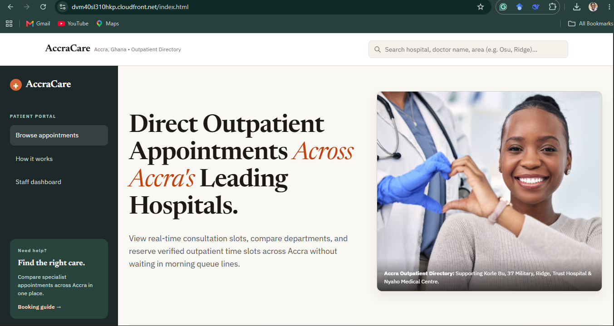

**Booking dialog**
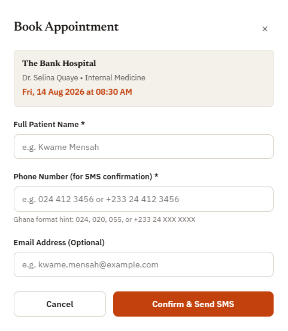

**Booking confirmation**
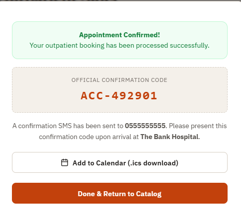

### Admin portal

**Publishing a new slot and managing capacity**
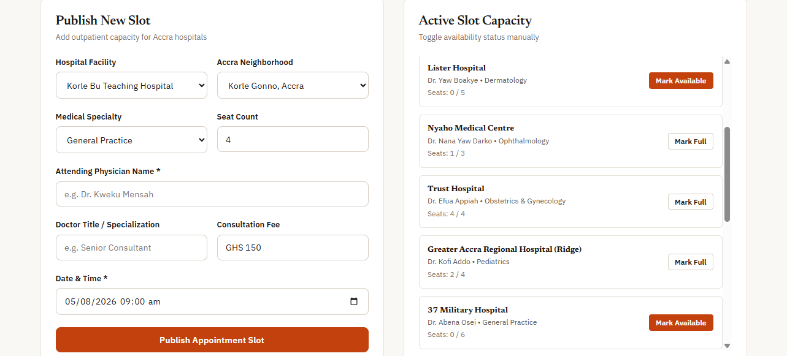

**Patient bookings registry**
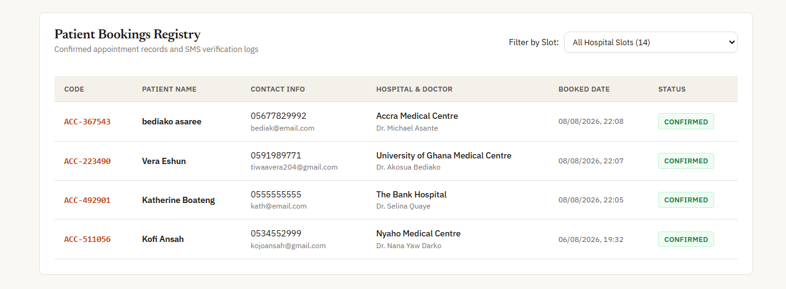

### AWS infrastructure

**CloudFormation stack, all resources deployed**
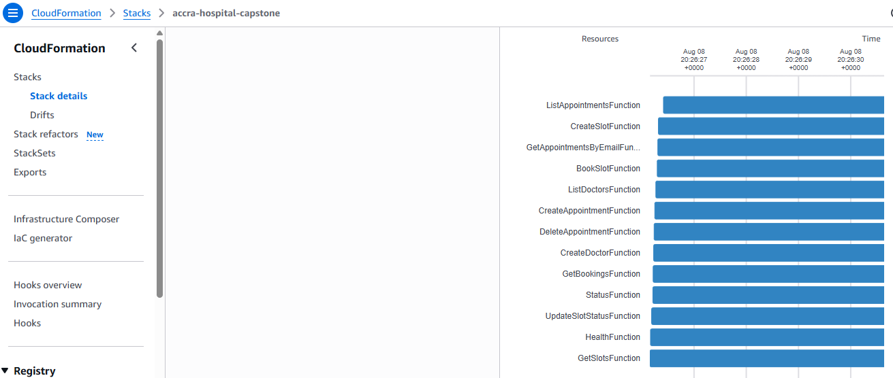

**CloudFormation template**
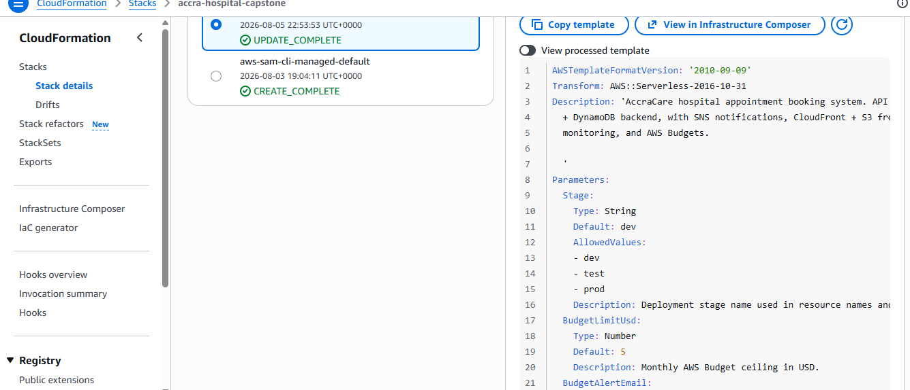

**Lambda functions, all 15 deployed**
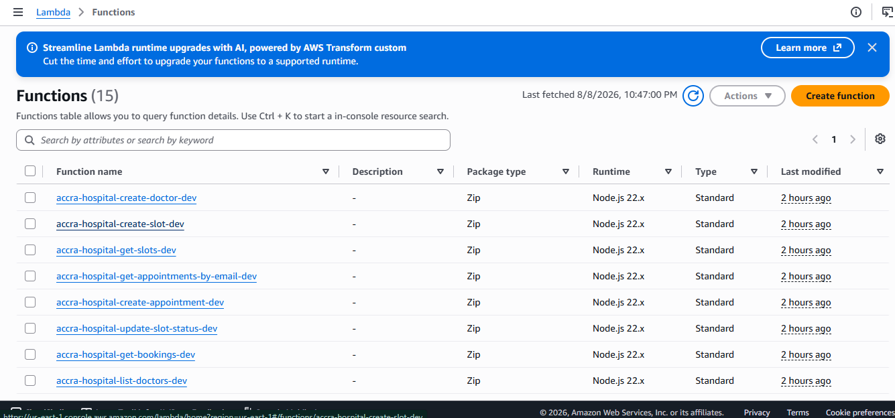

**Lambda source — book slot**
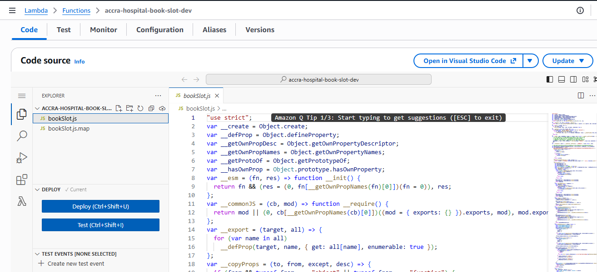

**Lambda source — delete booking**


**Lambda source — get slots**
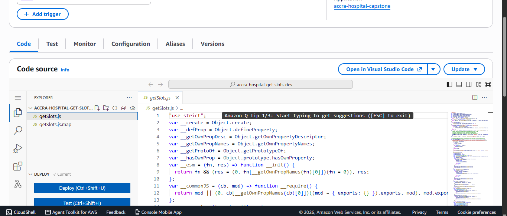

**DynamoDB — slots table**
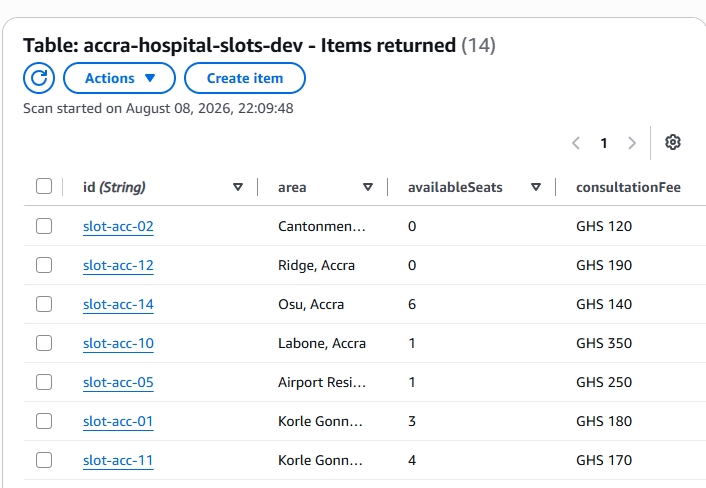

**DynamoDB — bookings table**
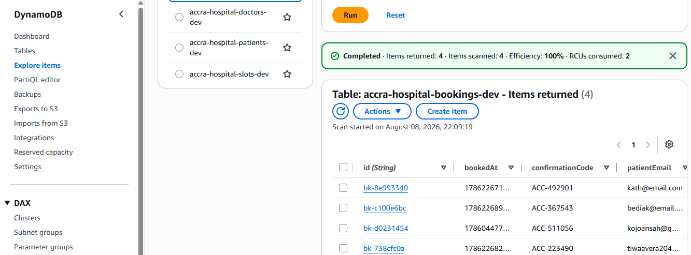

### Monitoring

**CloudWatch alarms**
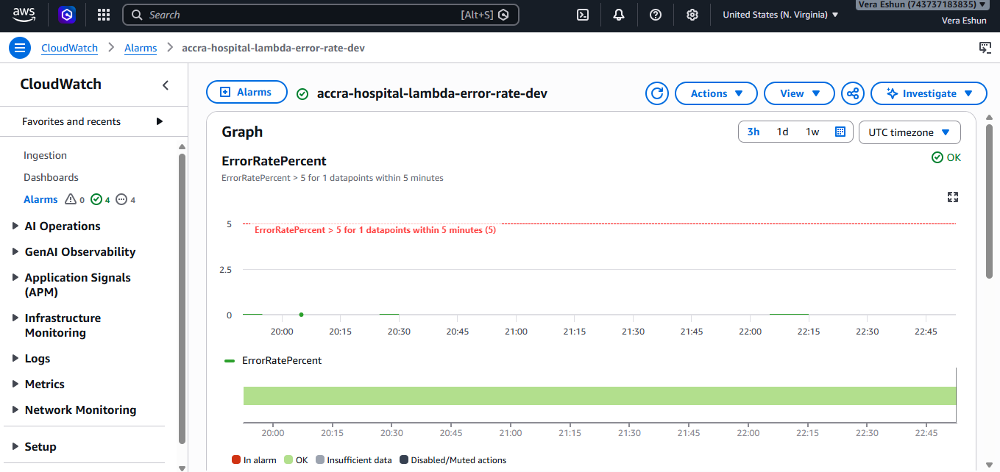
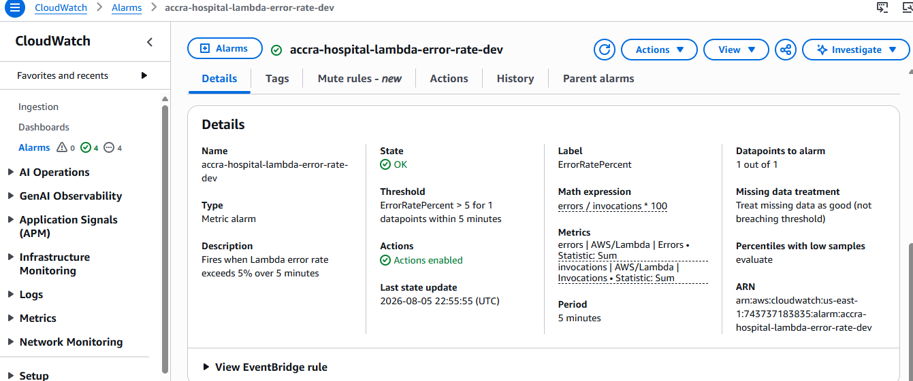

**CloudWatch metrics**
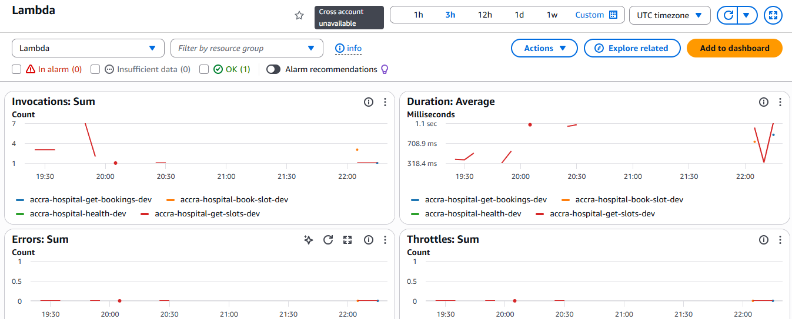

**CloudWatch logs**
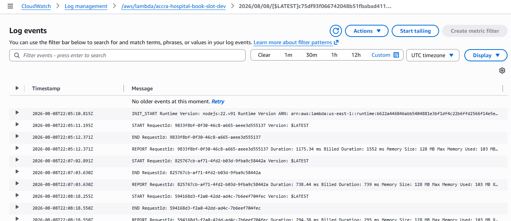

### CI/CD and repository

**GitHub Actions — deployment history**
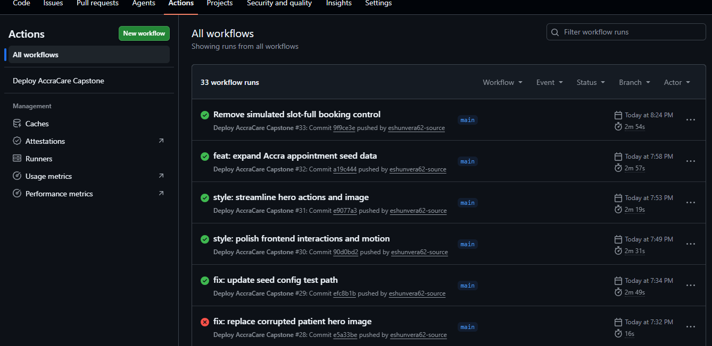

**Repository structure**
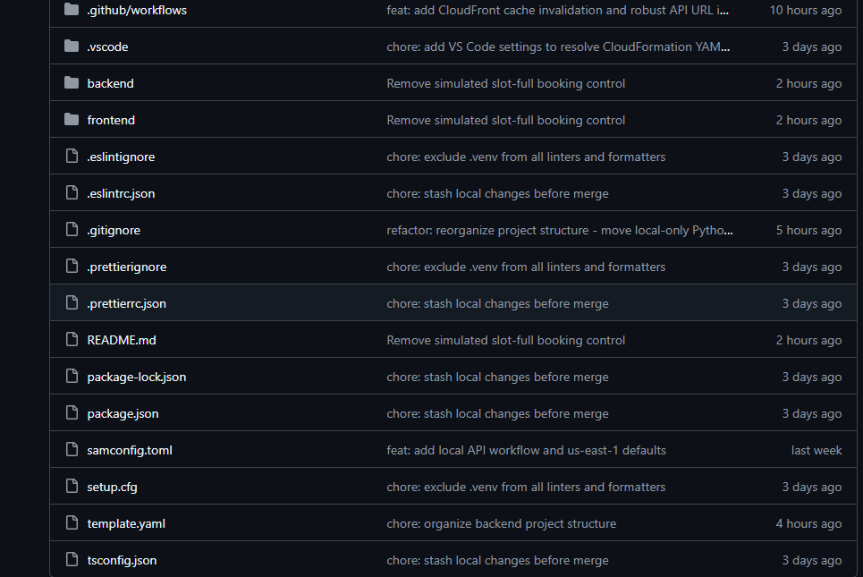

---

## REST API Endpoints

| Method | Path                       | Description                         |
| ------ | -------------------------- | ----------------------------------- |
| POST   | /slots                     | Create an appointment slot (admin)  |
| GET    | /slots                     | List all available slots            |
| POST   | /slots/{slotId}/book       | Book a slot — register for an event |
| PATCH  | /slots/{slotId}/status     | Open / close a slot (admin)         |
| GET    | /bookings                  | List all bookings                   |
| GET    | /bookings/by-email/{email} | View registrations by patient email |
| DELETE | /bookings/{id}             | Cancel a registration               |

---

## Project Layout

```
accra-hospital-capstone/
├── template.yaml                        # SAM/CloudFormation — all AWS resources
├── samconfig.toml                       # sam deploy defaults
├── .github/workflows/deploy.yml         # CI/CD: test → build → deploy → seed → sync
├── frontend/                            # Static website (index.html, admin.html)
│   └── scripts/api.js                   # Calls the real API Gateway URL
├── backend/
│   ├── src/                             # TypeScript Lambda handlers (deployed, Node 22)
│   │   ├── handlers/                    #   health, status, slots, bookings, doctors, appointments
│   │   └── utils/                       #   dynamo client + response helpers
│   ├── lambdas/                         # Python 3.12 Lambda handlers (deployed)
│   │   ├── get_bookings_by_email.py     #   GET /bookings/by-email/{email}
│   │   └── delete_booking.py            #   DELETE /bookings/{id}
│   ├── local_handlers/                  # Python handlers used ONLY by local_api.py
│   │   ├── get_slots.py
│   │   ├── create_slot.py
│   │   ├── book_slot.py
│   │   ├── get_bookings.py
│   │   └── update_slot_status.py
│   ├── local_api.py                     # Local dev server (http://127.0.0.1:3001)
│   ├── env.json                          # Local SAM environment variables
│   ├── events/                           # Sample events for SAM local invocations
│   └── seed/                            # Seed data + unit tests
│       ├── seed_slots.json
│       ├── load_seed_data.py
│       ├── test_load_seed_data.py
│       └── test_config_defaults.py
```

---

## File & Folder Reference

This section explains what every file and folder in the repository does.

### Root-level configuration

| Path                | Purpose                                                                                                                                                                                                                                                                  |
| ------------------- | ------------------------------------------------------------------------------------------------------------------------------------------------------------------------------------------------------------------------------------------------------------------------ |
| `template.yaml`     | **The heart of the infrastructure.** SAM/CloudFormation template defining all AWS resources: API Gateway, 5 DynamoDB tables, 15 Lambda functions, SNS topics, S3 bucket, CloudFront distribution, CloudWatch alarms/dashboard, and AWS Budgets. `sam deploy` reads this. |
| `samconfig.toml`    | Saved defaults for `sam deploy` so you don't need the `--guided` interactive prompts after the first run. Stores stack name, region, and parameter overrides.                                                                                                            |
| `package.json`      | Root Node.js project manifest. Defines scripts (`build`, `lint`, `format`, `test`, `sam:build`, `sam:validate`) and shared dev dependencies (TypeScript, ESLint, Prettier, Jest, esbuild).                                                                               |
| `package-lock.json` | Locks the exact versions of all npm dependencies for reproducible installs.                                                                                                                                                                                              |
| `tsconfig.json`     | Root TypeScript compiler config. Compiles `backend/src/**` to the `dist/` folder using `module: ES2022` and `moduleResolution: Bundler`.                                                                                                                                 |
| `.gitignore`        | Files/folders Git should ignore: `node_modules`, `.venv`, `dist/`, `.aws-sam/`, `__pycache__/`, and the accidental nested `AccraCare/` repo.                                                                                                                             |
| `.eslintrc.json`    | ESLint configuration for the TypeScript handlers (using `@typescript-eslint`). Enforces no unused imports and warns on `console` usage.                                                                                                                                  |
| `.eslintignore`     | Files ESLint should skip: `node_modules`, `dist`, `.venv`, `.aws-sam`, `coverage`.                                                                                                                                                                                       |
| `.prettierrc.json`  | Prettier code-formatter settings (100-char width, single quotes, trailing commas, 2-space tabs).                                                                                                                                                                         |
| `.prettierignore`   | Files Prettier should skip: `node_modules`, `dist`, `.venv`, `.aws-sam`, `coverage`.                                                                                                                                                                                     |
| `setup.cfg`         | Flake8 and Pylint (Python linters) configuration. Tells them to ignore virtual envs and build folders.                                                                                                                                                                   |
| `README.md`         | This documentation file.                                                                                                                                                                                                                                                 |

### `.github/workflows/`

| Path                           | Purpose                                                                                                                                                                                                                                                                                                                            |
| ------------------------------ | ---------------------------------------------------------------------------------------------------------------------------------------------------------------------------------------------------------------------------------------------------------------------------------------------------------------------------------- |
| `.github/workflows/deploy.yml` | **CI/CD pipeline** triggered on every push to `main`. Runs 4 jobs in sequence: (1) Python unit tests, (2) `sam validate --lint` + `sam build` + `sam deploy` and captures stack outputs, (3) seeds DynamoDB with demo slots, (4) injects the real API URL into the frontend, syncs it to S3, and invalidates the CloudFront cache. |

### `frontend/` — static website (S3 + CloudFront)

| Path                                     | Purpose                                                                                                                                                                                                                                                                                         |
| ---------------------------------------- | ----------------------------------------------------------------------------------------------------------------------------------------------------------------------------------------------------------------------------------------------------------------------------------------------- |
| `frontend/index.html`                    | **Patient portal** — the public-facing page. Lets patients browse, search, and filter available appointment slots, and book them via a modal.                                                                                                                                                   |
| `frontend/admin.html`                    | **Staff/admin portal** — reachable at `/admin.html`. Has a mock login, a form to publish new slots, slot capacity toggles, and a patient bookings registry table.                                                                                                                               |
| `frontend/scripts/api.js`                | **Data-access layer.** All frontend-to-backend API calls live here (`fetchSlots`, `createSlot`, `bookSlot`, `fetchBookings`, `updateSlotStatus`). Contains the `API_BASE_URL` logic — CI injects the real URL at deploy time; otherwise it falls back to `http://127.0.0.1:3001` for local dev. |
| `frontend/scripts/app.js`                | Entry point for `index.html`. Wires up the slot catalog and booking modal.                                                                                                                                                                                                                      |
| `frontend/scripts/slots.js`              | Renders the slot cards, handles search/filtering by hospital, department, and availability.                                                                                                                                                                                                     |
| `frontend/scripts/booking.js`            | Manages the booking modal: form validation, Ghana phone-number checks, success receipts, and genuine slot-capacity errors. Also generates `.ics` calendar downloads.                                                                                                                            |
| `frontend/scripts/admin.js`              | Powers the admin portal: mock staff login, create-slot form, slot status toggles, and the bookings table.                                                                                                                                                                                       |
| `frontend/styles/base.css`               | Design tokens (colors, fonts), CSS reset, and typography. Uses a terracotta accent on a warm off-white palette.                                                                                                                                                                                 |
| `frontend/styles/layout.css`             | Page layout styles (header, hero, catalog sections, footer).                                                                                                                                                                                                                                    |
| `frontend/styles/components.css`         | Reusable component styles (buttons, badges, cards, modal, forms, tables).                                                                                                                                                                                                                       |
| `frontend/assets/accra_patient_hero.jpg` | Hero image displayed on the patient portal.                                                                                                                                                                                                                                                     |

### `backend/src/` — TypeScript Lambda handlers (deployed)

> These Node.js 22 handlers are built with **esbuild** and deployed via SAM. Each file maps to one Lambda function.

| Path                                             | HTTP Endpoint                  | Purpose                                                                                                                                                                                |
| ------------------------------------------------ | ------------------------------ | -------------------------------------------------------------------------------------------------------------------------------------------------------------------------------------- |
| `backend/src/handlers/health.ts`                 | `GET /health`                  | Simple health check returning `{ status: "ok" }`.                                                                                                                                      |
| `backend/src/handlers/status.ts`                 | `GET /status`                  | Returns service metadata (name, version, uptime).                                                                                                                                      |
| `backend/src/handlers/getSlots.ts`               | `GET /slots`                   | Lists all appointment slots (paginated scan, newest first).                                                                                                                            |
| `backend/src/handlers/createSlot.ts`             | `POST /slots`                  | Creates a new slot. Zod-validates input, generates a `slot-acc-*` ID.                                                                                                                  |
| `backend/src/handlers/bookSlot.ts`               | `POST /slots/{slotId}/book`    | **Core booking logic.** Atomically decrements `availableSeats` using a DynamoDB conditional write to prevent double-booking, then creates a booking and publishes an SNS confirmation. |
| `backend/src/handlers/updateSlotStatus.ts`       | `PATCH /slots/{slotId}/status` | Opens/closes a slot (sets `status` to `available`/`full`). Used by the admin portal.                                                                                                   |
| `backend/src/handlers/getBookings.ts`            | `GET /bookings`                | Lists bookings, optionally filtered by `?slotId=` (uses the `slotId-index` GSI).                                                                                                       |
| `backend/src/handlers/listDoctors.ts`            | `GET /doctors`                 | Lists all doctors.                                                                                                                                                                     |
| `backend/src/handlers/createDoctor.ts`           | `POST /doctors`                | Creates a doctor record.                                                                                                                                                               |
| `backend/src/handlers/listAppointments.ts`       | `GET /appointments`            | Lists all appointments.                                                                                                                                                                |
| `backend/src/handlers/createAppointment.ts`      | `POST /appointments`           | Creates an appointment (30-day TTL).                                                                                                                                                   |
| `backend/src/handlers/getAppointmentsByEmail.ts` | `GET /appointments/{id}`       | Queries appointments by patient email via the `patientEmail-index` GSI.                                                                                                                |
| `backend/src/handlers/deleteAppointment.ts`      | `DELETE /appointments/{id}`    | Deletes an appointment.                                                                                                                                                                |
| `backend/src/utils/dynamo.ts`                    | —                              | Shared DynamoDB client (with options to ignore undefined values).                                                                                                                      |
| `backend/src/utils/response.ts`                  | —                              | Shared response helpers (`jsonResponse`, `errorResponse`) that add CORS + security headers to every response.                                                                          |
| `backend/src/package.json`                       | —                              | Dependencies for the Lambda runtime (AWS SDK, zod, uuid, esbuild).                                                                                                                     |
| `backend/src/tsconfig.json`                      | —                              | TypeScript config for the Lambda build (CommonJS, outputs to `dist/`).                                                                                                                 |

### `backend/lambdas/` — Python 3.12 Lambda handlers (deployed)

| Path                                       | HTTP Endpoint                    | Purpose                                                                                                  |
| ------------------------------------------ | -------------------------------- | -------------------------------------------------------------------------------------------------------- |
| `backend/lambdas/get_bookings_by_email.py` | `GET /bookings/by-email/{email}` | Returns all bookings for a patient email using the `patientEmail-index` GSI. Validates the email format. |
| `backend/lambdas/delete_booking.py`        | `DELETE /bookings/{id}`          | Cancels a booking. Validates the ID, checks it exists, then deletes with a conditional write.            |

### `backend/local_handlers/` — Python handlers for local dev only

> These are **not deployed** to AWS. They exist so the local dev server (`local_api.py`) can simulate the API without needing the TypeScript build. They mirror the slots/bookings TypeScript handlers.

| Path                                           | Simulated Endpoint             | Purpose                                              |
| ---------------------------------------------- | ------------------------------ | ---------------------------------------------------- |
| `backend/local_handlers/get_slots.py`          | `GET /slots`                   | Lists slots (mirrors `getSlots.ts`).                 |
| `backend/local_handlers/create_slot.py`        | `POST /slots`                  | Creates a slot (mirrors `createSlot.ts`).            |
| `backend/local_handlers/book_slot.py`          | `POST /slots/{slotId}/book`    | Books a slot (mirrors `bookSlot.ts`).                |
| `backend/local_handlers/get_bookings.py`       | `GET /bookings`                | Lists bookings (mirrors `getBookings.ts`).           |
| `backend/local_handlers/update_slot_status.py` | `PATCH /slots/{slotId}/status` | Toggles slot status (mirrors `updateSlotStatus.ts`). |

### `backend/local_api.py`

A lightweight local HTTP server (runs on `http://127.0.0.1:3001`) that loads the `local_handlers` directly. It lets you develop and test the frontend end-to-end without deploying to AWS. Start it with:

```bash
python backend/local_api.py --port 3001
```

### `backend/env.json`

Local environment variables for `sam local invoke` and `sam local start-api`. It maps each function to its DynamoDB table names and region so handlers can run locally without deploying.

### `backend/seed/` — seed data and tests

| Path                                   | Purpose                                                                                                               |
| -------------------------------------- | --------------------------------------------------------------------------------------------------------------------- |
| `backend/seed/seed_slots.json`         | Demo data: 6 realistic appointment slots across Accra hospitals (Korle Bu, 37 Military, Ridge, Trust, Nyaho, Lister). |
| `backend/seed/load_seed_data.py`       | Script that loads `seed_slots.json` into the deployed `SlotsTable`. Run after deploy.                                 |
| `backend/seed/test_load_seed_data.py`  | Unit tests for the seed loader.                                                                                       |
| `backend/seed/test_config_defaults.py` | Unit tests for config defaults (region, template).                                                                    |

### `backend/events/` — sample Lambda events for local testing

Used with `sam local invoke <FunctionName> --event backend/events/<file>.json` to test a single handler without a live API call.

| Path                                     | Target function       |
| ---------------------------------------- | --------------------- |
| `backend/events/get_slots_event.json`    | `GetSlotsFunction`    |
| `backend/events/create_slot_event.json`  | `CreateSlotFunction`  |
| `backend/events/book_slot_event.json`    | `BookSlotFunction`    |
| `backend/events/get_bookings_event.json` | `GetBookingsFunction` |

---

## Phase Deliverables Checklist

### Phase 1 — Infrastructure Foundation

- [x] S3 + CloudFront for static frontend hosting
- [x] AWS Lambda (Python 3.12) for serverless compute
- [x] API Gateway REST API with CORS, throttling, access logging
- [x] IAM least-privilege roles via SAM managed policies
- [x] All resources defined in `template.yaml` (SAM/CloudFormation)

### Phase 2 — API Development

- [x] `POST /slots` — create slot (register event)
- [x] `GET /slots` — list all slots (list events)
- [x] `GET /bookings/by-email/{email}` — view registrations by email
- [x] `DELETE /bookings/{id}` — cancel registration
- [x] DynamoDB table design: SlotsTable + BookingsTable with GSIs
- [x] Input validation and sanitisation in every handler
- [x] CORS headers on all responses
- [x] SNS email confirmation on successful booking

### Phase 3 — Automation & CI/CD

- [x] GitHub repository with `main` and `fix/code-review` branches
- [x] GitHub Actions workflow: test → build → deploy → seed → frontend sync
- [x] Automated Python unit tests run on every push (must pass before deploy)
- [x] `sam validate --lint` runs in CI before every deploy
- [x] Deployment fully automated — no manual steps after merge to main

### Phase 4 — Monitoring & Security

- [x] CloudWatch Logs on all Lambda functions (14-day retention)
- [x] CloudWatch Alarm: Lambda error rate > 5% → SNS ops alert
- [x] CloudWatch Alarm: API Gateway 5xx errors ≥ 1 per 5 minutes → SNS ops alert
- [x] CloudWatch Dashboard: invocations, errors, duration, API request count
- [x] API Gateway access logging (JSON format)
- [x] Input validation + regex sanitisation on all path/query/body params
- [x] IAM least-privilege (DynamoDBReadPolicy / DynamoDBCrudPolicy per function)
- [x] DynamoDB SSE-KMS, PITR, TTL on both tables
- [x] S3 SSE-S3 (AES256) encryption + versioning + lifecycle
- [x] SNS topics encrypted with `alias/aws/sns`
- [x] HTTPS-only bucket policy (DenyNonHttps)
- [x] AWS Budgets: 80% actual and 100% forecasted monthly cost alerts

### Phase 5 — Deployment & Optimisation

- [x] `sam build && sam deploy` — single command deploy
- [x] `samconfig.toml` — saved deploy defaults (no `--guided` needed after first run)
- [x] DynamoDB TTL — automatic expiry of old records (cost optimisation)
- [x] CloudFront CDN — reduced S3 egress cost, HTTPS enforced
- [x] PAY_PER_REQUEST billing on all DynamoDB tables (Free Tier friendly)
- [x] Lambda 128 MB memory, 10s timeout (right-sized for capstone workload)

---

## Quick Start

```bash
# 1. Build
sam build

# 2. First deploy (interactive — enter your emails when prompted)
sam deploy --guided

# 3. Every deploy after that
sam deploy

# 4. Seed demo slots
cd backend/seed
python load_seed_data.py <SlotsTableName_from_output>

# 5. Upload frontend
aws s3 sync ../../frontend s3://<FrontendBucketName_from_output> --delete

# 6. Get the live URL
sam list stack-outputs --stack-name accra-hospital-capstone
```

## AWS Deployment Guide

AccraCare is deployed as a single AWS SAM/CloudFormation stack. It provisions the API Gateway API, Lambda functions, DynamoDB tables, SNS topics and subscriptions, CloudWatch logs and alarms, budget resources, and the S3/CloudFront frontend hosting resources.

Before deploying, install and configure the AWS CLI and AWS SAM CLI, plus Node.js (for the TypeScript Lambda dependencies) and Python 3.12 (for seed-data tests and loading). The AWS identity must be able to create the resources in `template.yaml`, including IAM roles, Lambda, API Gateway, DynamoDB, SNS, CloudWatch, S3, CloudFront, Budgets, and CloudFormation.

From the repository root, configure credentials, install the Lambda dependencies, validate, and build:

```bash
aws configure
cd backend/src && npm install && cd ../..
sam validate --lint
sam build
```

For the first deployment, run `sam deploy --guided`. Choose a `dev`, `test`, or `prod` stage; enter the budget and notification email addresses; allow SAM to create IAM roles; and save the answers to `samconfig.toml`. Set `AdminApiKey` to a long random value for admin-only routes, and set `FrontendOrigin` to the CloudFront URL used by the browser client. Do not commit either value. Confirm the SNS subscription email so booking and operational alerts can be delivered.

For later releases, use `sam build && sam deploy`. Retrieve the stack outputs with `sam list stack-outputs --stack-name accra-hospital-capstone`, load demo slots with `backend/seed/load_seed_data.py`, set `API_BASE_URL` in `frontend/scripts/api.js` to `ApiBaseUrl` (with no trailing slash), and sync the frontend to `FrontendBucketName`. Open `FrontendWebsiteUrl` and verify a booking, its SNS confirmation, and CloudWatch logs.

Pushing to `main` runs the GitHub Actions workflow: it tests the seed scripts, validates/builds/deploys the SAM stack, seeds DynamoDB, injects the API URL into the frontend, syncs it to S3, and invalidates CloudFront. Configure the required secrets below before relying on that workflow.

To avoid charges after the project is no longer needed, empty the deployment bucket before deleting the stack:

```bash
aws s3 rm s3://<FrontendBucketName> --recursive
sam delete --stack-name accra-hospital-capstone
```

## Local Development

```bash
# Install Node dependencies (TypeScript utils)
npm install

# Run Python unit tests
cd backend/seed && python -m unittest discover -v

# Local API simulation
sam local start-api --env-vars backend/env.json
# curl http://localhost:3000/slots

# Test a single function
sam local invoke GetSlotsFunction --event backend/events/get_slots_event.json
```

## GitHub Actions Secrets Required

| Secret                  | Description                                      |
| ----------------------- | ------------------------------------------------ |
| `AWS_ACCESS_KEY_ID`     | IAM user access key (or use OIDC role instead)   |
| `AWS_SECRET_ACCESS_KEY` | IAM user secret key                              |
| `AWS_ROLE_TO_ASSUME`    | IAM role ARN for OIDC (replaces key/secret)      |
| `BUDGET_ALERT_EMAIL`    | Email for AWS Budget and ops alarm notifications |
| `NOTIFICATION_EMAIL`    | Email for booking confirmation SNS topic         |
| `ADMIN_API_KEY`         | **Shared secret API key** for admin-only endpoints. Generate with `openssl rand -hex 32`; inject it into Lambda environment variables only, never the public frontend. |
| `FRONTEND_ORIGIN`       | The CloudFront distribution URL (e.g. `https://d123.cloudfront.net`) used for CORS allow-listing. |

---

## Security Hardening

This project has been audited and hardened with the following security controls:

### Authentication & Authorization
- **Admin-only endpoints** (`POST /slots`, `PATCH /slots/{id}/status`, `GET /bookings`, `DELETE /bookings/{id}`, `GET /bookings/by-email/{email}`, `POST /appointments`, `DELETE /appointments/{id}`, `GET /appointments`, `GET /appointments/{id}`, `POST /doctors`) require a valid `x-api-key` header.
- The key is validated using **constant-time comparison** (`crypto.timingSafeEqual` / `hmac.compare_digest`) to prevent timing attacks.
- The key is stored as a **GitHub Actions secret** and injected via SAM parameter overrides — never hard-coded in source.
- If `ADMIN_API_KEY` is not configured, endpoints **fail closed** (deny by default).

### Data Protection
- **PII endpoints** (bookings, appointments) are admin-only — anonymous users cannot read patient data.
- **`DataTraceEnabled: false`** on API Gateway — prevents full request/response bodies (including PII) from being logged to CloudWatch.
- **`Cache-Control: no-store`** on all API responses — prevents PII from being cached by browsers or intermediaries.
- **`Strict-Transport-Security`** header — forces HTTPS.
- **`X-Content-Type-Options: nosniff`**, **`X-Frame-Options: DENY`**, **`Referrer-Policy: no-referrer`**, **`Content-Security-Policy`** headers on all responses.

### CORS Hardening
- **No wildcard `*`** — the `Access-Control-Allow-Origin` header is only set when the request's `Origin` matches the allow-list (`FRONTEND_ORIGIN` / `CORS_ORIGINS`).
- CloudFront viewers are redirected to HTTPS. (S3 website origins support HTTP only.)

### Input Validation & Injection Prevention
- **Zod schemas** validate all path/query/body parameters on every TypeScript handler.
- **Regex validation** on all path parameters (slot IDs, booking IDs, emails).
- **XSS protection** — all user/API-derived values rendered in the frontend are escaped via `escapeHtml()` or set via `textContent` (never `innerHTML`).
- **Error messages are sanitized** — internal exception details are never leaked to clients.

### Cryptography
- **Confirmation codes** use `crypto.randomInt` (CSPRNG) instead of `Math.random()` — prevents code forgery.
- **UUIDs** use `crypto.randomUUID()` (CSPRNG) instead of the global `crypto` object.
- **DynamoDB SSE** enabled on all tables.
- **SNS topics** encrypted with `alias/aws/sns`.

### Rate Limiting & Throttling
- API Gateway throttling: **100 burst / 50 rate** per second.
- CloudWatch alarms on Lambda error rate > 5% and API Gateway 5xx errors.
